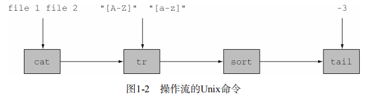
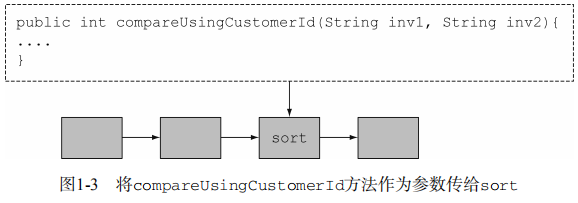

# 			java8实战

## 一.基础知识

### 1.为什么关系java8

#### 1.1java8怎么还在变

##### 1.1.1java在编程语言中所处的地位

- 前景:

  C和C++仍然是构建操作系统和各种嵌入式系统的流行工具，因为它们编出的程序尽管安全性不佳，但运行时占用资源少。缺乏安全性可能导致程序意外崩溃，并把安全漏洞暴露给病毒和其他东西；确实，Java和C#等安全型语言在诸多运行资源不太紧张的应用中已经取代了C和C++。


- 学习的意义:

  Java 8对于程序员提供了更多的编程工具和概念，能以更快，更重要的是能以更为简洁、更易于维护的方式解决新的或现有的编程问题。

##### 1.1.2 流处理

- 概念:

  流是一系列数据项，一次只生成一项。程序可以从输
  入流中一个一个读取数据项，然后以同样的方式将数据项写入输出流。一个程序的输出流很可能
  是另一个程序的输入流。

  ```unix
  cat file1 file2 | tr "[A-Z]" "[a-z]" | sort | tail -3 
  ```

  ​	

  ​

  基于这一思想，Java 8在java.util.stream中添加了一个**Stream API**；

  > Java 8可以透明地把输入的不相关部分拿到几个CPU内核上去分别执行你的Stream操作流水线——这是几乎免费的并行，用不着去费劲搞Thread了。

##### 1.1.3 用行为参数化把代码传递给方法

- Java 8增加了把方法（你的代码）作为参数传递给另一个方法的能力。

  


##### 1.1.4 并行与共享的可变数据

  - 你的行为必须能够同时对不同的输入安全地执行。一般情况下这就意味着，你写代码时不能访问共享的可变数据。
  - <u>这两个要点（没有共享的可变数据，将方法和函数即代码传递给其他方法的能力）是我们平常所说的函数式编程范式的基石</u>
##### 1.1.5 Java 需要演变

- 使用List<String>而不只是List
- 使用for-each循环而不用暴露Iterator里面的套路写法

#### 1.2 Java 中的函数

##### 1.2.1 方法和 Lambda 作为一等公民

- 筛选隐藏文件,File类里面有一个叫作isHidden的方法。我们可以把它看作一个函数，接受一个File，返回一个布尔值。但要用它做筛选，你需要把它包在一个FileFilter对象里，然后传递给File.listFiles方法，如下所示:

  ```java
  //new File(".")这个.是当前目录的意思
  //.listFiles(FileFilter filter)返回过滤后抽象路径名数组
  File[] hiddenFiles = new File(".").listFiles(new FileFilter() { 
   public boolean accept(File file) { 
   return file.isHidden(); 
   } 
  }); 
  ```

- 如今在Java 8里，你可以把代码重写成这个样子：

  ```java
  File[] hiddenFiles = new File(".").listFiles(File::isHidden); 	
  ```

- 一个好处是，你的代码现在读起来更接近问题的陈述了。方法不再是二等值了。与用对象引用传递对象类似（对象引用是用new创建的），在Java 8里写下File::isHidden的时候，你就创建了一个方法引用，你同样可以传递它。

- Lambda——匿名函数::这句话的意思是“编写把函数作为一等值来传递的程序”。

##### 1.2.2 传递代码：一个例子


## 二.函数式数据处理

## 三.高效的java8编程

## 四.超越java8