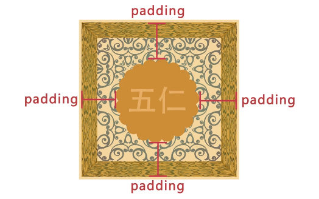
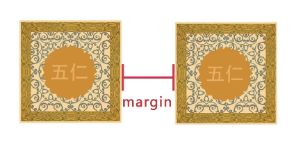
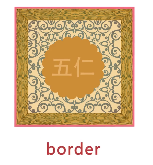

## 				Html And CSS Base

## 1.html介绍

### 1.1Html和CSS的关系

学习web前端开发基础技术需要掌握：HTML、CSS、JavaScript语言。下面我们就来了解下这三门技术都是用来实现什么的：

1. **HTML是网页内容的载体**。内容就是网页制作者放在页面上想要让用户浏览的信息，可以包含文字、图片、视频等。

2. **CSS样式是表现**。就像网页的外衣。比如，标题字体、颜色变化，或为标题加入背景图片、边框等。所有这些用来改变内容外观的东西称之为表现。


3. **JavaScript是用来实现网页上的特效效果**。如：鼠标滑过弹出下拉菜单。或鼠标滑过表格的背景颜色改变。还有焦点新闻（新闻图片）的轮换。可以这么理解，有动画的，有交互的一般都是用JavaScript来实现的

```html
<!DOCTYPE HTML>
<html>
    <head>
        <meta http-equiv="Content-Type" content="text/html; charset=utf-8">
        <title>Html和CSS的关系</title>
        <style type="text/css">
        h1{
            <!--文字大小-->
            font-size: 12px; 
            <!--文字颜色-->
            color: #930;
            <!--文字居中-->
            text-align: center;
        }
        </style>
    </head>
    <body>
        <h1>Hello World!</h1>
    </body>
</html>
```

### 1.2标签语法

1. **标签**由英文尖括号`**<**`和`**>**`括起来，如`<html>`就是一个标签。

\2. html中的标签一般都是成对出现的，分**开始标签**和**结束标签**。结束标签比开始标签多了一个`/`。

如：

（1） `<p></p>`

（2） `<div></div>`

（3） `<span></span>`

[](http://img.mukewang.com/528960dc0001cb6802710128.jpg)

\3. 标签与标签之间是可以嵌套的，但先后顺序必须保持一致，如：<div>里嵌套<p>，那么</p>必须放在</div>的前面。如下图所示。

[](http://img.mukewang.com/5289611a0001469c05510206.jpg)

\4. HTML标签不区分大小写，`<h1>`和`<H1>`是一样的，但建议小写，因为大部分程序员都以小写为准。

```html
<!DOCTYPE HTML>
<html>
    <head>
        <meta http-equiv="Content-Type" content="text/html; charset=utf-8">
        <title>标签的语法</title>
    </head>
    <body>
        <div>
            <h1>在本教程中，你将学习如何使用 HTML 来创建站点</h1>
        	<p>当特殊的样式需要应用到个别元素时，就可以使用内联样式。</p>
        </div>
    </body>
</html>
```

### 1.3认识head标签

下面我们来了解一下`<head>`标签的作用。文档的头部描述了文档的各种属性和信息，包括文档的标题等。绝大多数文档头部包含的数据都不会真正作为内容显示给读者。

下面这些标签可用在 head 部分：

```
<head>
    <title>...</title>
    <meta>
    <link>
    <style>...</style>
    <script>...</script>
</head>
```

`<title>`标签：在<title>和</title>标签之间的文字内容是网页的标题信息，它会出现在浏览器的标题栏中。网页的title标签用于告诉用户和搜索引擎这个网页的主要内容是什么，搜索引擎可以通过网页标题，迅速的判断出网页的主题。每个网页的内容都是不同的，每个网页都应该有一个独一无二的title。

例如：

```
<head>
    <title>hello world</title>
</head>
```

`<title>`标签的内容“hello world”会在浏览器中的标题栏上显示出来，如下图所示：

[](http://img.mukewang.com/5285fc8a0001d1da04100215.jpg)

### 1.4代码注释

什么是**代码注释**？**代码注释的作用**是帮助程序员标注代码的用途，过一段时间后再看你所编写的代码，就能很快想起这段代码的用途。**代码注释**不仅方便程序员自己回忆起以前代码的用途，还可以帮助其他程序员很快的读懂你的程序的功能，方便多人合作开发网页代码。

**语法：**

`<!--注释文字 -->`

```html
<!DOCTYPE HTML>
<html>
    <head>
        <meta http-equiv="Content-Type" content="text/html; charset=utf-8">
        <title>HTML的代码注释</title>
    </head>
    <body>
        <!--在线咨询 begin-->
        <div>
            <p>一站式报名咨询、助学答疑服务，无论是报名、选课、学习、做作业、考试、写论文，毕业，这里都有专业老师为你答疑解惑！<a href="#">向报名顾问咨询</a></p>
        </div>
        <!--在线咨询 end-->
    </body>
</html>
```

## 2.认识标签(一)

### 2.1< p >标签

如果想在网页上显示文章，这时就需要<p>标签了，把文章的段落放到<p>标签中。

语法：

`<p>段落文本</p>`

 注意一段文字一个`<p>`标签，如在一篇新闻文章中有3段文字，就要把这3个段落分别放到**3**个`<p>`标签中。如下图所示。

[](http://img.mukewang.com/528606c50001a5d304830211.jpg)

在浏览器中显示的效果：

[](http://img.mukewang.com/528606f000013fc405960399.jpg)

`<p>`标签的默认样式，可以在上图中看出来，段前段后都会有空白，如果不喜欢这个空白，可以用css样式来删除或改变它。

```html
<!DOCTYPE HTML>
<html>
<head>
<meta http-equiv="Content-Type" content="text/html; charset=utf-8">
<title> p标签</title>
</head>
<body>
    <p>我是第一个段落.</p>
    <p>我是第一个段落.</p>
</body>
</html>
```

### 2.2< hx >标签

文章的段落用`<p>`标签，那么文章的标题用什么标签呢？在本节我们将使用`<hx>`标签来制作**文章的标题**。
标题标签一共有6个，`h1、h2、h3、h4、h5、h6`分别为一级标题、二级标题、三级标题、四级标题、五级标题、六级标题。并且依据重要性递减。`<h1>`是最高的等级。
**语法：**
`<hx>标题文本</hx>` (x为1-6)
文章的标题前面已经说过了，可以使用标题标签，另外网页上的各个**栏目的标题**也可使用它们。如下图为腾讯网站。

[](http://img.mukewang.com/528970a400010df312740572.jpg)

注意：因为`h1`标签在网页中比较重要，所以一般`h1`标签被用在网站名称上。腾讯网站就是这样做的。如：`<h1>腾讯网</h1>`

**h1-h6****标签的默认样式：**

标签代码：


在浏览器中显示的样式：

[](http://img.mukewang.com/528970f4000143a405960399.jpg)

从上面的图片可以看出标题标签的样式都会加粗，`h1`标签字号最大，`h2`标签字号相对h1要小，以此类推`h6`标签的字号最小。

```html
<!DOCTYPE HTML>
<html>
<head>
<meta http-equiv="Content-Type" content="text/html; charset=utf-8">
<title>h1-h6标题标签</title>
</head>
<body>
    <h1>了不起的盖茨比</h1>
    <p>《了不起的盖茨比》为那个奢靡年代的缩影。盖茨比怀揣着对"美国梦"的期翼，投身到那个年代的灯红酒绿之中，却在名利场中看尽世态炎凉，以及浮华背后一切终将逝去的空虚怅惘。1925年《了不起的盖茨比》问世。 </p>
    <p>菲茨杰拉德，二十世纪美国文学巨擘之一，兼具作家和编剧双重身份。他以诗人的敏感和戏剧家的想象为"爵士乐时代"吟唱华丽挽歌，其诗人和梦想家的气质亦为那个奢靡年代的不二注解。</p>
</body>
</html>
```

### 2.3< strong >和< em >标签

 有了段落又有了标题，现在如果想在一段话中特别强调某几个文字，这时候就可以用到<em>或<strong>标签。

​       但两者在强调的语气上有区别:<em> 表示强调，<strong> 表示更强烈的强调。并且在浏览器中<em> 默认用**斜体**表示，<strong> 用**粗体**表示。两个标签相比，目前国内前端程序员更喜欢使用<strong>表示强调。

**语法：**

`<em>需要强调的文本</em>  `

`<strong>需要强调的文本</strong>` 

如，在网上商城中，某产品的打折后的价格是需要强调的。如下图。

[](http://img.mukewang.com/528b406b0001f06701720271.jpg)

代码实现：

[](http://img.mukewang.com/528b409a00015f1a02300097.jpg)

**在浏览器中默认样式是有区别的：**

原代码，如下图。

[](http://img.mukewang.com/528b41a80001b81509760314.jpg)

浏览器中的样子，如下图。

[](http://img.mukewang.com/528b41cf0001e8d306240377.jpg)

```html
<!DOCTYPE HTML>
<html>
<head>
<meta http-equiv="Content-Type" content="text/html; charset=utf-8">
<title>了不起的盖茨比</title>
</head>
<body>
    <p>1922年的春天，一个想要成名名叫<strong>尼克•卡拉威</strong>（托比•马奎尔Tobey Maguire饰）的作家，离开了美国中西部，来到了纽约。那是一个道德感渐失，爵士乐流行，走私为王，股票飞涨的时代。为了追寻他的美国梦，他搬入纽约附近一海湾居住。</p>
    <p>菲茨杰拉德，二十世纪美国文学巨擘之一，兼具作家和编剧双重身份。他以诗人的敏感和戏剧家的想象为"爵士乐时代"吟唱华丽挽歌，其诗人和梦想家的气质亦为那个奢靡年代的不二注解。</p>
</body>
</html>
```

### 2.4< span >标签

这一小节讲解<span>标签，我们对`<em>`、`<strong>`、`<span>`这三个标签进行一下总结：

1. `<em>`和`<strong>`标签是为了**强调**一段话中的关键字时使用，它们的语义是**强调。**

2. `<span>`标签是没有语义的，它的作用就是为了设置单独的样式用的。

如果现在我们想把上一小节的第一段话“美国梦”三个字设置成blue（蓝色），但注意不是为了**强调**“美国梦”，而只是想为它设置和其它文字不同的样式（并不想让屏幕阅读器对“美国梦”这三个字加重音读出），所以这样情况下就可以用到<span>标签了。

如下面例子：

```
<p>1922年的春天，一个想要成名名叫<em>尼克•卡拉威</em>（托比•马奎尔Tobey Maguire 饰）的作家，离开了美国中西部，来到了纽约。那是一个道德感渐失，爵士乐流行，走私为王，<strong>股票</strong>飞涨的时代。为了追寻他的<span>美国梦</span>，他搬入纽约附近一海湾居住。</p>
```

**语法：**

`<span>文本</span>`

```html
<!DOCTYPE HTML>
<html>
<head>
<meta http-equiv="Content-Type" content="text/html; charset=utf-8">
<title>了不起的盖茨比</title>
<style>
span{
    color: blue;
}
</style>
</head>
<body>
    <p>1922年的春天，一个想要成名名叫尼克•卡拉威（托比•马奎尔Tobey Maguire 饰）的作家，离开了美国中西部，来到了纽约。那是一个道德感渐失，爵士乐流行，走私为王，股票飞涨的时代。为了追寻他的<span>美国梦</span>，他搬入纽约附近一海湾居住。</p>
    <p>菲茨杰拉德，二十世纪美国文学巨擘之一，兼具作家和编剧双重身份。他以诗人的敏感和戏剧家的想象为"爵士乐时代"吟唱华丽挽歌，其诗人和梦想家的气质亦为那个奢靡年代的不二注解。</p>
</body>
</html>
```

### 2.5< q >标签

想在你的html中加一段引用吗？比如在你的网页的文章里想引用某个作家的一句诗，这样会使你的文章更加出彩，那么`<q>`标签是你所需要的。

**语法：**

`<q>引用文本</q>`

如下面例子：

```
<p>最初知道庄子，是从一首诗<q>庄生晓梦迷蝴蝶。望帝春心托杜鹃。</q>开始的。虽然当时不知道是什么意思，只是觉得诗句挺特别。后来才明白这个典故出自是庄子的《逍遥游》，《逍遥游》代表了庄子思想的最高境界，是对世俗社会的功名利禄及自己的舍弃。</p>
```

**讲解：**

\1. 在上面的例子中，“**庄生晓梦迷蝴蝶。望帝春心托杜鹃。**” 这是一句诗歌，出自晚唐诗人李商隐的《锦瑟》 。因为不是作者自己的文字，所以需要使用`<q></q>`实现引用。

\2. 注意要引用的文本不用加**双引号**，浏览器会对q标签自动添加双引号。

下图是代码显示结果：

[](http://img.mukewang.com/528c0ab90001413905750340.jpg)

注意这里用<q>标签的真正关键点不是它的默认样式**双引号**（如果这样我们不如自己在键盘上输入双引号就行了），而是它的**语义：引用别人的话**。

```html
<!DOCTYPE HTML>
<html>
<head>
<meta http-equiv="Content-Type" content="text/html; charset=utf-8">
<title>q标签</title>
</head>
<body>
<p>周瑜，不可否认，他是历史上一个了不起的英雄人物！确实也配的上那句<q>聪明秀出为之英，胆略过人为之雄。</q></p>
</body>
</html>
```

### 2.6< blockquote >标签

<blockquote>的作用也是引用别人的文本。但它是对**长文本**的引用，如在文章中引入大段某知名作家的文字，这时需要这个标签。

​      等等，上一节<q>标签不是也是对文本的引用吗？不要忘记`<q>`标签是对**简短文本**的引用，比如说引用一句话就用到`<q>`标签。

​      如想在我的文章中引用李白《关山月》中的诗句，因为引用文本比较长，所以使用`**<**blockquote>`。

**语法:**

`**<**blockquote>引用文本</blockquote>`

如下面例子：

```
<blockquote>明月出天山，苍茫云海间。长风几万里，吹度玉门关。汉下白登道，胡窥青海湾。由来征战地，不见有人还。 戍客望边色，思归多苦颜。高楼当此夜，叹息未应闲。</blockquote>
```

浏览器对**<**blockquote>标签的解析是**缩进样式。如下图所示：**

****

```html
<!DOCTYPE HTML>
<html>
<head>
<meta http-equiv="Content-Type" content="text/html; charset=utf-8">
<title>blockquote标签的使用</title>
</head>
<body>
<h2>心似桂花开</h2>
<p>大家都在忙于自认为最重要的事情，却没能享受到人生的乐趣，反而要吞下苦果？</p>
<blockquote>暗淡轻黄体性柔，情疏迹远只香留。何须浅碧深红色，自是花中第一流</blockquote>。
<p>这是李清照《咏桂》中的词句，在李清照看来，桂花暗淡青黄，性情温柔，淡泊自适，远比那些大红大紫争奇斗艳花值得称道。</p>
</body>
</html>
```

### 2.7< br >标签

对于上一小节的例子，我们想让那首诗显示得更美观些，如显示下面效果：

[](http://img.mukewang.com/5292e6ee00014d6406260408.jpg)

怎么可以让每一句诗词后面加入一个折行呢？那就可以用到`<br />`标签了，在需要加回车换行的地方加入<br />，<br />标签作用相当于word文档中的回车。

上节的代码改为：


**语法：**

**xhtml1.0写法：**

`<br />`

**html4.01写法：**

`<br>`

大家注意，现在一般使用 xhtml1.0 的版本的写法（其它标签也是），这种版本比较规范。

​      与以前我们学过的标签不一样，`<br />`标签是一个空标签，没有HTML内容的标签就是空标签，空标签只需要写一个开始标签，这样的标签有`<br />`、`<hr />`和``。

​      讲到这里，你是不是有个疑问，想折行还不好说嘛，就像在 word 文件档或记事本中，在想要折行的前面输入回车不就行了吗？很遗憾，在 html 中是忽略**回车**和**空格**的，你输入的再多回车和空格也是显示不出来的。如下边的代码。

[](http://img.mukewang.com/5292ec400001f2f003370176.jpg)

上面的代码在浏览中显示是没有回车效果的。如下图所示：

[](http://img.mukewang.com/5292ec740001fdcd05810242.jpg)

**总结：在 html 代码中输入回车、空格都是没有作用的。在html文本中想输入回车换行，就必须输入<br />。**

```html
<!DOCTYPE HTML>
<html>
<head>
<meta http-equiv="Content-Type" content="text/html; charset=utf-8">
<title>br标签的使用</title>
</head>
<body>
<h2>《咏桂》</h2>
<p>暗淡轻黄体性柔，<br/>
情疏迹远只香留。<br/>
何须浅碧深红色，<br/>
自是花中第一流。</p>
</body>
</html>
```

### 2.8空格

在上一节的例子，我们已经讲解过在html代码中输入**空格**、**回车**都是没有作用的。要想输入空格，必须写入`&nbsp;`。

**语法：**

`&nbsp;`

在html代码中输入空格是不起作用的，如下代码。

[](http://img.mukewang.com/5293242e0001213409300258.jpg)

在浏览中显示，还是没有空格效果。

[](http://img.mukewang.com/5293245e0001be3705750340.jpg)

**输入空格的正确方法：**

[](http://img.mukewang.com/529325ad0001f9a104940133.jpg)

在浏览器中的显示出来的空格效果。如下图所示。

[](http://img.mukewang.com/529325cf0001eb0c04590266.jpg)

```html
<!DOCTYPE HTML>
<html>
<head>
<meta http-equiv="Content-Type" content="text/html; charset=utf-8">
<title>空格讲解</title>
</head>
<body>
<h1>感悟梦想</h1>
来源：作文网&nbsp;&nbsp;作者：为梦想而飞 
</body>
</html>
```

### 2.9< hr >标签

在信息展示时，有时会需要加一些用于分隔的横线，这样会使文章看起来整齐些。如下图所示：

[](http://img.mukewang.com/52932bbc0001c12206620372.jpg)

**语法：**

html4.01版本** **`<hr>`

xhtml1.0版本 `<hr />`

**注意：**

1. `<hr />`标签和`<br />`标签一样也是一个**空标签**，所以只有一个开始标签，没有结束标签。

2. `<hr />`标签的在浏览器中的默认样式线条比较粗，颜色为灰色，可能有些人觉得这种样式不美观，没有关系，这些外在样式在我们以后学习了css样式表之后，都可以对其修改。

3. 大家注意，现在一般使用 xhtml1.0 的版本（其它标签也是），这种版本比较规范。


```html
<!DOCTYPE HTML>
<html>
<head>
<meta http-equiv="Content-Type" content="text/html; charset=utf-8">
<title>hr标签使用</title>
</head>
<body>
<p>火车飞驰过暗夜里的村庄，月光，总是太容易让思念寂寞，太容易让人觉得孤独。</p>
<hr/>
<p>每一枚被风吹起的蒲公英，都载满了一双眼睛的深情告别与一个目光的依依不舍。那天，我拿着行李，带上一个背影的祝福与惆怅，挥手告别了这片土地。我不知道，我何时会回来。</p>
</body>
</html>
```

### 2.10< address >标签

一般网页中会有一些网站的联系地址信息需要在网页中展示出来，这些联系地址信息如公司的地址就可以<address>标签。也可以定义一个地址（比如电子邮件地址）、签名或者文档的作者身份。

**语法：**

`<address>联系地址信息</address>`

如：

`<address>文档编写：lilian 北京市西城区德外大街10号</address>`

```
<address>
本文的作者：<a href="mailto:lilian@imooc.com">lilian</a>
</address>
```

​      在浏览器上显示的样式为**斜体**，如果不喜欢斜体，当然可以，可以在后面的课程中使用 css 样式来修改它`<address>`标签的默认样式。

[](http://img.mukewang.com/52a917910001c16404780355.jpg)

### 2.11< code >标签

在介绍语言技术的网站中，避免不了在网页中显示一些计算机专业的编程代码，当代码为一行代码时，你就可以使用<code>标签了，如下面例子：

`<code>var i=i+300;</code>`

注意：在文章中一般如果要插入多行代码时不能使用<code>标签了。

**语法：**

`<code>代码语言</code>`

注：如果是多行代码，可以使用<pre>标签。

### 2.12< pre >标签

在上节中介绍加入一行代码的标签为<code>，但是在大多数情况下是需要加入大段代码的，如下图：

[](http://img.mukewang.com/52a519bd0001441604710369.jpg)

怎么办？不会是每一代码都加入一个<code>标签吧，没有这么复杂，这时候就可以使用<pre>标签。

**语法：**

`<pre>语言代码段</pre>`

<pre> 标签的主要作用:预格式化的文本。被包围在 pre 元素中的文本通常会保留空格和换行符。

如下代码：

```
<pre>
    var message="欢迎";
    for(var i=1;i<=10;i++)
    {
        alert(message);
    }
</pre>
```

在浏览器中的显示结果为：

[](http://img.mukewang.com/52a51a4f000118c403790224.jpg)

在上面的例子中可以看到代码中的空格，换行符都保留下来。如果用以前的方法，回车需要输入`<br>`签，空格需要输入`&nbsp;`

**注意：**`<pre>` 标签不只是为显示计算机的源代码时用的，在你需要在网页中预显示格式时都可以使用它，只是`<pre>`标签的一个常见应用就是用来展示计算机的源代码。

## 3.认识标签(二)

### 3.1< ul >标签

在浏览网页时，你会发现网页上有很多信息的列表，如新闻列表、图片列表，如下图所示。

[](http://img.mukewang.com/52d383cd0001085503320216.jpg)

新闻列表

[](http://img.mukewang.com/52d3840f0001575f03260138.jpg)

图片列表

这些列表就可以使用ul-li标签来完成。ul-li是**没有前后顺序**的信息列表。

**语法：**

```
<ul>
  <li>信息</li>
  <li>信息</li>
   ......
</ul>
```

**举例：**

```
<ul>
  <li>精彩少年</li>
  <li>美丽突然出现</li>
  <li>触动心灵的旋律</li>
</ul>
```

ul-li在网页中显示的默认样式一般为：每项li前都自带一个圆点，如下图所示：


### 3.2< ol >标签

如果想在网页中展示**有前后顺序**的信息列表，怎么办呢？如，当当网上的书籍热卖排行榜，如下图所示。这类信息展示就可以使用`<ol>`标签来制作**有序列表**来展示。

[](http://img.mukewang.com/52d3884a00014b0702270264.jpg)

**语法：**

```
<ol>
   <li>信息</li>
   <li>信息</li>
   ......
</ol>
```

**举例：**

下面是一个热点课程下载排行榜：

```
<ol>
   <li>前端开发面试心法 </li>
   <li>零基础学习html</li>
   <li>JavaScript全攻略</li>
</ol>
```

`<ol>`在网页中显示的默认样式一般为：每项`<li>`前都自带一个序号，序号默认从`1`开始，如下图所示：

[](http://img.mukewang.com/52d3893400019ee003830208.jpg)

### 3.3< div >

在网页制作过程过中，可以把一些独立的逻辑部分划分出来，放在一个`<div>`标签中，这个<div>标签的作用就相当于一个容器。

**语法：**

`<div>…</div>`

**确定逻辑部分：**

什么是逻辑部分？它是页面上相互关联的一组元素。如网页中的独立的**栏目版块**，就是一个典型的逻辑部分。如下图所示：图中用红色边框标出的部分就是一个逻辑部分，就可以使用`<div>`标签作为容器。

[](http://img.mukewang.com/52d38c41000163e210120455.jpg)

### 3.4< div >命名

在上一小节中，我们把一些标签放进<div>里，划分出一个独立的逻辑部分。为了使逻辑更加清晰，我们可以为这一个独立的逻辑部分设置一个名称，用`id`属性来为`<div>`提供唯一的名称，这个就像我们每个人都有一个身份证号，这个身份证号是唯一标识我们的身份的，也是必须唯一的。

如下两图进行比较，如果设计师把两个图给你，哪个图你看上去能更快的理解呢？是不是右边的那幅图呢。

[](http://img.mukewang.com/52d38d7b00017fb804800357.jpg)

**语法：**

`<div  id="版块名称">…</div>`

### 3.5< table >标签

有时候我们需要在网页上展示一些数据，如某公司想在网页上展示公司的库存清单。如下表：

[](http://img.mukewang.com/52d38f0b00017e4305060133.jpg)

想在网页上展示上述表格效果可以使用以下代码：

[](http://img.mukewang.com/52d38f83000160be02920445.jpg)

创建表格的四个元素：

table、tbody、tr、th、td

1、<table>…</table>：整个表格以`<table>`标记开始、`</table>`标记结束。

2、<tbody>…</tbody>：如果不加<thead><tbody><tfooter> , table表格加载完后才显示。加上这些表格结构， tbody包含行的内容下载完优先显示，不必等待表格结束后在显示，同时如果表格很长，用tbody分段，可以一部分一部分地显示。（通俗理解table 可以按结构一块块的显示，不在等整个表格加载完后显示。）

 

3、<tr>…</tr>：表格的一行，所以有几对tr 表格就有几行。

4、<td>…</td>：表格的一个单元格，一行中包含几对`<td>...</td>`，说明一行中就有几列。

5、<th>…</th>：表格的头部的一个单元格，**表格表头。**

6、表格中列的个数，取决于一行中数据单元格的个数。

上述代码在浏览器中显示的默认的样式为：

[](http://img.mukewang.com/52d3902b0001142703730239.jpg)

总结：

1、table表格在没有添加css样式之前，在浏览器中显示是没有表格线的

2、表头，也就是th标签中的文本默认为**粗体**并且**居中**显示

### 3.6CSS样式

Table 表格在没有添加 css 样式之前，是没有边框的。这样不便于我们后期**合并单元格**知识点的讲解，所以在这一节中我们为表格添加一些样式，为它添加边框。

在右侧代码编辑器中添加如下代码：

```
<style type="text/css">
table tr td,th{border:1px solid #000;}
</style>
```

上述代码是用 css 样式代码（**后面章节会详细讲解**），为`th`，`td`单元格添加粗细为一个像素的黑色边框。

结果窗口显示出结果样式：

[](http://img.mukewang.com/52d3993b00010d6203900285.jpg)

### 3.7< caption >标签

表格还是需要添加一些标签进行优化，可以添加**标题**和**摘要**。代码如下：

[](http://img.mukewang.com/52d3a1610001a42606940398.jpg)

**摘要**

摘要的内容是不会在浏览器中显示出来的。它的作用是增加表格的可读性(语义化)，使搜索引擎更好的读懂表格内容，还可以使屏幕阅读器更好的帮助特殊用户读取表格内容。

​    **语法：**`<table summary="表格简介文本">`

**标题**

用以描述表格内容，标题的显示位置：表格上方。

​     **语法：**

```
<table>
    <caption>标题文本</caption>
    <tr>
        <td>…</td>
        <td>…</td>
        …
    </tr>
…
</table>
```

## 4.认识标签(三)

### 4.1< a >标签

使用`<a>`标签可实现超链接，它在网页制作中可以说是无处不在，只要有链接的地方，就会有这个标签。

**语法：**

```
<a  href="目标网址"  title="鼠标滑过显示的文本">链接显示的文本</a>
```

**例如：**

```
<a  href="http://www.imooc.com"  title="点击进入慕课网">click here!</a>
```

上面例子作用是单击`click here!`文字，网页链接到`http://www.imooc.com`这个网页。

title属性的作用，鼠标滑过链接文字时会显示这个属性的文本内容。这个属性在实际网页开发中作用很大，主要方便搜索引擎了解链接地址的内容（语义化更友好）

**注意：**还有一个有趣的现象不知道小伙伴们发现了没有，只要为文本加入a标签后，文字的颜色就会自动变为蓝色（被点击过的文本颜色为紫色），颜色很难看吧，不过没有关系后面我们学习了css样子就可以设置过来（a{color:#000}),后面会详细讲解。

### 4.2< a >标签跳转打开新页面

`<a>`标签在默认情况下，链接的网页是在当前浏览器窗口中打开，有时我们需要在新的浏览器窗口中打开。

如下代码：

`<a href="目标网址" **target="_blank"**>click here!</a>`

```html
<!DOCTYPE HTML>
<html>
<head>
<meta http-equiv="Content-Type" content="text/html; charset=utf-8">
<title>了不起的盖茨比</title>
</head>
<body>
    <p>1922年的春天，一个想要成名名叫尼克•卡拉威（<a href="http://www.m1905.com/mdb/star/3316/" target="_blank">托比•马奎尔Tobey Maguire </a>饰）的作家，离开了美国中西部，来到了纽约。那是一个道德感渐失，爵士乐流行，走私为王，股票飞涨的时代。为了追寻他的美国梦，他搬入纽约附近一海湾居住。</p>
    <p>菲茨杰拉德，二十世纪美国文学巨擘之一，兼具作家和编剧双重身份。他以诗人的敏感和戏剧家的想象为"爵士乐时代"吟唱华丽挽歌，其诗人和梦想家的气质亦为那个奢靡年代的不二注解。</p>
</body>
</html>
```

### 4.3mailto

`<a>`标签还有一个作用是可以链接Email地址，使用mailto能让访问者便捷向网站管理者发送电子邮件。我们还可以利用`mailto`做许多其它事情。下面一一进行讲解，请看详细图示：

[](http://img.mukewang.com/52da4f2a000150b714280550.jpg)

**注意**：如果mailto后面同时有多个参数的话，第一个参数必须以“`?`”开头，后面的参数每一个都以“`&`”分隔。

下面是一个完整的实例:

[](http://img.mukewang.com/52da52200001e00e07930061.jpg)

在浏览器中显示的结果：

```
发送
```

点击链接会打开电子邮件应用，并自动填写收件人等设置好的信息，如下图：

[](http://img.mukewang.com/52da5026000148a706850470.jpg)

```html
<!DOCTYPE HTML>
<html>
<head>
<meta http-equiv="Content-Type" content="text/html; charset=gb2312" />
<title>mailto</title>
</head>
<body>
<p>1922年的春天，一个想要成名名叫卡拉威（马奎尔Tobey Maguire 饰）的作家，离开了美国中西部，来到了纽约。那是一个道德感渐失，爵士乐流行，走私为王，股票飞涨的时代。为了追寻他的美国梦，他搬入纽约附近一海湾居住。</p>
    <p>菲茨杰拉德，二十世纪美国文学巨擘之一，兼具作家和编剧双重身份。他以诗人的敏感和戏剧家的想象为"爵士乐时代"吟唱华丽挽歌，其诗人和梦想家的气质亦为那个奢靡年代的不二注解。</p>
<a href="mailto:yy@imooc.com?subject=观了不起的盖茨比有感&body=你好，对此评论有些想法">对此影评有何感想，发送邮件给我</a>
</body>
</html>
```

### 4.4< img >标签

在网页的制作中为使网页炫丽美观，肯定是缺少不了图片，可以使用``标签来插入图片。

**语法：**

``

**举例：**

``

**讲解：**

**1**、**src**：标识图像的位置；

**2**、**alt**：指定图像的描述性文本，当图像不可见时（下载不成功时），可看到该属性指定的文本；

**3**、**title**：提供在图像可见时对图像的描述(鼠标滑过图片时显示的文本)；

**4、**图像可以是GIF，PNG，JPEG格式的图像文件。

## 5.表单标签

### 5.1< form >标签

网站怎样与用户进行交互？答案是使用HTML表单(form)。表单是可以把浏览者输入的数据传送到服务器端，这样服务器端程序就可以处理表单传过来的数据。

语法：

```
<form   method="传送方式"   action="服务器文件">
```

**讲解：**

1.**<form> ：**<form>标签是成对出现的，以<form>开始，以</form>结束。

2.**action** **：**浏览者输入的数据被传送到的地方,比如一个PHP页面(save.php)。

3.**method** **：** 数据传送的方式（get/post）。

```
<form    method="post"   action="save.php">
        <label for="username">用户名:</label>
        <input type="text" name="username" />
        <label for="pass">密码:</label>
        <input type="password" name="pass" />
</form>
```

**注意:**

**1、所有表单控件（文本框、文本域、按钮、单选框、复选框等）都必须放在 <form></form> 标签之间（否则用户输入的信息可提交不到服务器上哦！）。**

### 5.2text/password

当用户要在表单中键入字母、数字等内容时，就会用到**文本输入框**。文本框也可以转化为**密码输入框**。

**语法**：

```
<form>
   <input type="text/password" name="名称" value="文本" />
</form>
```

```
1、type：

   当type="text"时，输入框为文本输入框;

   当type="password"时, 输入框为密码输入框。

2、name：为文本框命名，以备后台程序ASP 、PHP使用。

3、value：为文本输入框设置默认值。(一般起到提示作用)
```

`**举例**`**：**

```
<form>
  姓名：
  <input type="text" name="myName">
  <br/>
  密码：
  <input type="password" name="pass">
</form>
```

在浏览器中显示的结果：

[](http://img.mukewang.com/52e4e9be000152ca05250275.jpg)

### 5.3< textarea >标签

当用户需要在表单中输入大段文字时，需要用到文本输入域。

**语法**：

```
<textarea  rows="行数" cols="列数">文本</textarea>
```

`1``、<textarea>标签是成对出现的，以<textarea>开始，以</textarea>结束。`

`2``、**cols ：**``多行输入域的**列数**。`

`3``、**rows ：**``多行输入域的**行数**。`

`4``、在<textarea></textarea>标签之间可以输入**默认值**。`

`**举例**`**：**

```
<form  method="post" action="save.php">
        <label>联系我们</label>
        <textarea cols="50" rows="10" >在这里输入内容...</textarea>
</form>
```

注意：代码中的<label>标签在本章5-9中讲解。

在浏览器中显示结果：

[](http://img.mukewang.com/52e5b4040001f4af05760367.jpg)

注意这两个属性可用css样式的width和height来代替：col用width、row用height来代替。（这两个css样式在以后的章节会讲解）

### 5.4radio/checkbox

`在使用表单设计调查表时，为了减少用户的操作，使用选择框是一个好主意，html中有两种选择框，即**单选框**和**复选框**，两者的区别是**单选框**中的选项用户只能选择一项，而**复选框**中用户可以任意选择多项，甚至全选。请看下面的例子:`

`语法：`

```
<input   type="radio/checkbox"   value="值"    name="名称"   checked="checked"/>
```

1、**type:**

   当 **type="radio" **时，控件为**单选框**

   当 **type="checkbox"** 时，控件为**复选框**

2、**value：**提交数据到服务器的值（后台程序PHP使用）

3、**name：**为控件命名，以备后台程序 ASP、PHP 使用

4、**checked：**当设置 checked="checked" 时，该选项被默认选中

如下面代码：

[](http://img.mukewang.com/52e5f7c60001a23f07360267.jpg)

注意：代码中的<label>标签在本章 5-9 中有讲解。

在浏览器中显示的结果：

[](http://img.mukewang.com/52e5f8010001159804900257.jpg)

注意**:同一组**的单选按钮，name 取值一定要一致，比如上面例子为同一个名称“radioLove”，这样同一组的单选按钮才可以起到单选的作用。

### 5.5< select >标签

下拉列表在网页中也常会用到，它可以有效的节省网页空间。既可以单选、又可以多选。如下代码：

[](http://img.mukewang.com/52e604590001ae4005270185.jpg)

**讲解：**

**1、value：**

[](http://img.mukewang.com/52e6037300015a9905030165.jpg)

2、**selected="selected"**：

设置**selected="selected"**属性，则该选项就被默认选中。

在浏览器中显示的结果：

[](http://img.mukewang.com/52e605340001014804520288.jpg)


### 5.5< select >标签多选

下拉列表也可以进行多选操作，在<select>标签中设置`multiple="multiple"`属性，就可以实现多选功能，在 windows 操作系统下，进行多选时按下`**Ctrl**`键同时进行`**单击**`（在 Mac下使用 Command +单击），可以选择多个选项。如下代码：

[](http://img.mukewang.com/52e60c020001b7f805000178.jpg)

在浏览器中显示的结果：

[](http://img.mukewang.com/52e60c5d00013ced04900257.jpg)

### 5.6提交

在表单中有两种按钮可以使用，分别为：提交按钮、重置。这一小节讲解提交按钮：当用户需要提交表单信息到服务器时，需要用到**提交按钮**。

**语法**：

```
<input   type="submit"   value="提交">
```

`type``**：只有当type值设置为submit时，按钮才有提交作用**`

`value``**：**``按钮上显示的文字`

`**举例**`**：**

****

在浏览器中显示的结果：

[](http://img.mukewang.com/52e6126f0001496a04480218.jpg)

### 5.7重置

当用户需要重置表单信息到初始时的状态时，比如用户输入“用户名”后，发现书写有误，可以使用`重置按钮`使输入框恢复到初始状态。只需要把type设置为"reset"就可以。

**语法**：

`<input **type="reset"** value="重置">`

`type``**：只有当type值设置为reset时，按钮才有重置作用**`

`value``**：**``按钮上显示的文字`

`**举例**`**：**

[](http://img.mukewang.com/52e618680001a6b204570101.jpg)

在浏览器中显示的结果：

[](http://img.mukewang.com/52e6189e000186b604480218.jpg)

输入账号

[](http://img.mukewang.com/52e618bc00015a1004480218.jpg)

单击重置按钮

### 5.8< lable >标签

小伙伴们，你们在前面学习表单各种控件的时候，有没有发现一个标签--label，这一小节就来揭晓它的作用。

label标签不会向用户呈现任何特殊效果，它的作用是为鼠标用户改进了可用性。如果你在 label 标签内点击文本，就会触发此控件。就是说，当用户单击选中该label标签时，浏览器就会自动将焦点转到和标签相关的表单控件上（就自动选中和该label标签相关连的表单控件上）。

语法：

```xml
<label for="控件id名称">
```

注意：标签的 for 属性中的值应当与相关控件的 id 属性值一定要相同。

例子：

```xml
<form>
  <label for="male">男</label>
  <input type="radio" name="gender" id="male" />
  <br />
  <label for="female">女</label>
  <input type="radio" name="gender" id="female" />
  <label for="email">输入你的邮箱地址</label>
  <input type="email" id="email" placeholder="Enter email">
</form>
```

## 6.CSS样式

### 6.1认识CSS样式

CSS全称为“层叠样式表 (Cascading Style Sheets)”，它主要是用于定义HTML内容在浏览器内的显示样式，如文字大小、颜色、字体加粗等。

如下列代码：

```css
p{
   font-size:12px;
   color:red;
   font-weight:bold;
}
```

使用CSS样式的一个好处是通过定义某个样式，可以让不同网页位置的文字有着统一的字体、字号或者颜色等。

### 6.2CSS优势

为什么使用css样式来设置网页的外观样式呢？右边编辑器是一段文字，我们想把“`超酷的互联网`”、“`服务及时贴心`”、“`有趣易学`”这三个短语的文本颜色设置为红色，这时就 可以通过设置样式来设置，而且只需要编写一条css样式语句。

第一步：把这三个短语用<span></span>括起来。（见下边代码编辑器`13`行）

第二步：写入下列代码：（见下边代码编辑器`7-8`行）

```
span{
    color:red;
}
```

观察结果窗口文字的颜色是否变为红色了。

```html
<!DOCTYPE HTML>
<html>
<head>
<meta http-equiv="Content-Type" content="text/html; charset=utf-8">
<title>CSS样式的优势</title>
<style type="text/css">
span{
   color:red;
}
</style>
</head>
<body>
    <p>慕课网，<span>超酷的互联网</span>、IT技术免费学习平台，创新的网络一站式学习、实践体验；<span>服务及时贴心</span>，内容专业、<span>有趣易学</span>。专注服务互联网工程师快速成为技术高手！</p>
</body>
</html>
```

### 6.3CSS语法

css 样式由**选择符**和**声明**组成，而**声明**又由**属性**和**值**组成，如下图所示：

[](http://img.mukewang.com/52fde5c30001b0fe03030117.jpg)

**选择符：**又称选择器，指明网页中要应用样式规则的元素，如本例中是网页中所有的段（p）的文字将变成蓝色，而其他的元素（如ol）不会受到影响。

**声明：**在英文大括号“｛｝”中的的就是声明，属性和值之间用英文冒号“：”分隔。当有多条声明时，中间可以英文分号“;”分隔，如下所示：

```
p{font-size:12px;color:red;}
```

注意：

1、最后一条声明可以没有分号，但是为了以后修改方便，一般也加上分号。

2、为了使用样式更加容易阅读，可以将每条代码写在一个新行内，如下所示：

``` css
p{
   font-size:12px;
   color:red;
}
```

### 6.4CSS注释

就像在Html的注释一样，在CSS中也有注释语句：用`/*注释语句*/`来标明（Html中使用`<!--注释语句-->`)。就像下面代码：

[](http://img.mukewang.com/52fd724e0001768503250108.jpg)

## 11.CSS盒模型

### 11.1元素分类

在讲解CSS布局之前，我们需要提前知道一些知识，在CSS中，html中的标签元素大体被分为三种不同的类型：**块状元素**、**内联元素(又叫行内元素)**和**内联块状元素**。

**常用的块状元素有：**

<div>、<p>、<h1>...<h6>、<ol>、<ul>、<dl>、<table>、<address>、<blockquote> 、<form>

**常用的内联元素有：**

<a>、<span>、<br>、<i>、<em>、<strong>、<label>、<q>、<var>、<cite>、<code>

**常用的内联块状元素有**：

、<input>

### 11.2块级元素

什么是块级元素？在html中<div>、 <p>、<h1>、<form>、<ul> 和 <li>就是块级元素。设置`display:block`就是将元素显示为块级元素。如下代码就是将**内联元素a**转换为**块状元素**，从而使a元素具有**块状元素**特点。

```
a{display:block;}
```

**块级元素特点：**

1、每个块级元素都从新的一行开始，并且其后的元素也另起一行。（真霸道，一个块级元素独占一行）

2、元素的高度、宽度、行高以及顶和底边距都可设置。

3、元素宽度在不设置的情况下，是它本身父容器的100%（和父元素的宽度一致），除非设定一个宽度。

### 11.3内联元素

在html中，<span>、<a>、<label>、 <strong> 和<em>就是典型的**内联元素**（**行内元素**）（inline）元素。当然**块状元素**也可以通过代码`display:inline`将元素设置为**内联元素**。如下代码就是将**块状元素div**转换为**内联元素**，从而使 div 元素具有**内联元素**特点。

```
 div{
     display:inline;
 }

......

<div>我要变成内联元素</div>
```

**内联元素特点：**

1、和其他元素都在一行上；

2、元素的高度、宽度及顶部和底部边距**不可**设置；

3、元素的宽度就是它包含的文字或图片的宽度，不可改变。

小伙伴们你们观查一下右侧代码段，有没有发现一个问题，内联元素之间有一个间距问题，这个问题在本小节的 wiki 中有介绍，感兴趣的小伙伴可以去查看。

### 11.4内联块状元素

**内联块状元素（**inline-block**）**就是同时具备内联元素、块状元素的特点，代码`display:inline-block`就是将元素设置为内联块状元素。(css2.1新增)，、<input>标签就是这种内联块状标签。

inline-block 元素特点：

1、和其他元素都在一行上；

2、元素的高度、宽度、行高以及顶和底边距都可设置。

### 11.5盒子模型

盒子模型
内容：文字，图片，和标签元素。
内填充：padding



外边距：margin



边框：border



内填充，外边距，边框都有四个方向（top,bottom,left,right）

### 11.6盒模型--边框（一）

盒子模型的边框就是围绕着内容及补白的线，这条线你可以设置它的粗细、样式和颜色(边框三个属性)。

如下面代码为 div 来设置边框粗细为 2px、样式为实心的、颜色为红色的边框：

```
div{
    border:2px  solid  red;
}
```

上面是 border 代码的缩写形式，可以分开写：

```
div{
    border-width:2px;
    border-style:solid;
    border-color:red;
}
```

**注意：**

1、border-style（边框样式）常见样式有：

dashed（虚线）| dotted（点线）| solid（实线）。

2、border-color（边框颜色）中的颜色可设置为十六进制颜色，如:

```
border-color:#888;//前面的井号不要忘掉。
```

3、border-width（边框宽度）中的宽度也可以设置为：

thin | medium | thick（但不是很常用），最常还是用象素（px）。

### 11.7盒模型--边框（二）

现在有一个问题，如果有想为 p 标签单独设置下边框，而其它三边都不设置边框样式怎么办呢？css 样式中允许只为一个方向的边框设置样式：

```
div{border-bottom:1px solid red;}
```

同样可以使用下面代码实现其它三边(上、右、左)边框的设置：

```css
border-top:1px solid red;
border-right:1px solid red; 
border-left:1px solid red;
```

### 11.8盒模型--宽度和高度

盒模型宽度和高度和我们平常所说的物体的宽度和高度理解是不一样的，css内定义的宽（width）和高（height），指的是填充以里的内容范围。

因此一个元素实际宽度（盒子的宽度）=左边界+左边框+左填充+内容宽度+右填充+右边框+右边界。

[](http://img.mukewang.com/539fbb3a0001304305570259.jpg)

元素的高度也是同理。

比如：

css代码：

```
div{
    width:200px;
    padding:20px;
    border:1px solid red;
    margin:10px;    
}
```

html代码：

```
<body>
   <div>文本内容</div>
</body>
```

元素的实际长度为：10px+1px+20px+200px+20px+1px+10px=262px。在chrome浏览器下可查看元素盒模型，如下图：

[](http://img.mukewang.com/543b4cae0001b34304300350.jpg)

### 11.9盒模型--填充

元素内容与边框之间是可以设置距离的，称之为“填充”。填充也可分为上、右、下、左(顺时针)。如下代码：

```
div{padding:20px 10px 15px 30px;}
```

顺序一定不要搞混。可以分开写上面代码：

```
div{
   padding-top:20px;
   padding-right:10px;
   padding-bottom:15px;
   padding-left:30px;
}
```

如果上、右、下、左的填充都为10px;可以这么写

```
div{padding:10px;}
```

如果上下填充一样为10px，左右一样为20px，可以这么写：

```
div{padding:10px 20px;}
```

### 11.10盒模型--边界

元素与其它元素之间的距离可以使用边界（margin）来设置。边界也是可分为上、右、下、左。如下代码：

```
div{margin:20px 10px 15px 30px;}
```

也可以分开写：

```
div{
   margin-top:20px;
   margin-right:10px;
   margin-bottom:15px;
   margin-left:30px;
}

```

如果上右下左的边界都为10px;可以这么写：

```
div{ margin:10px;}
```

如果上下边界一样为10px，左右一样为20px，可以这么写：

```
div{ margin:10px 20px;}
```

总结一下：padding和margin的区别，padding在边框里，margin在边框外。

## 12.布局模型

### 12.1css布局模型

清楚了CSS 盒模型的基本概念、 盒模型类型， 我们就可以深入探讨网页布局的基本模型了。布局模型与盒模型一样都是 CSS 最基本、 最核心的概念。 但布局模型是建立在盒模型基础之上，又不同于我们常说的 CSS 布局样式或 CSS 布局模板。如果说布局模型是本，那么 CSS 布局模板就是末了，是外在的表现形式。 
CSS包含3种基本的布局模型，用英文概括为：Flow、Layer 和 Float。
在网页中，元素有三种布局模型：
1、流动模型（Flow）
2、浮动模型 (Float)
3、层模型（Layer）

### 12.2流动模型(一)

先来说一说**流动模型**，流动（Flow）是默认的网页布局模式。也就是说网页在默认状态下的 HTML 网页元素都是根据流动模型来分布网页内容的。

流动布局模型具有2个比较典型的特征：

第一点，**块状元素**都会在所处的**包含元素内**自上而下按顺序垂直延伸分布，因为在默认状态下，块状元素的宽度都为**100%**。实际上，块状元素都会以行的形式占据位置。如下面代码中三个块状元素标签(div，h1，p)宽度显示为100%。

```xml
<meta http-equiv="Content-Type" content="text/html; charset=utf-8">
<title>流动模式下的块状元素</title>
<style type="text/css">
#box1{
    width:300px;
    height:100px;
}
div,h1,p{
    border:1px solid red;
}
</style>
</head>
<body>
    <div id="box2">box2</div><!--块状元素，由于没有设置宽度，宽度默认显示为100%--> 
    <h1>标题</h1><!--块状元素，由于没有设置宽度，宽度默认显示为100%--> 
    <p>文本段文本段文本段文本段文本段文本段文本段文本段文本段文本段文本段文本段文本段文本段文本段文本段文本段。</p><!--块状元素，由于没有设置宽度，宽度默认显示为100%--> 
    
    <div id="box1">box1</div><!--块状元素，由于设置了width:300px，宽度显示为300px-->
</body>
</html>
```

### 12.3流动模型（二）

第二点，在流动模型下，**内联元素**都会在所处的包含元素内从左到右水平分布显示。（内联元素可不像块状元素这么霸道独占一行）

下面代码中内联元素标签a、span、em、strong都是内联元素。

```xml
<!DOCTYPE HTML>
<html>
<head>
<meta http-equiv="Content-Type" content="text/html; charset=utf-8">
<title>流动模式下的内联元素</title>
<style type="text/css">

</style>
</head>
<body>
    <a href="http://www.imooc.com">www.imooc.com</a><span>强调</span><em>重点</em>
    <strong>强调</strong>
</body>
</html>
```

### 12.4浮动模型

块状元素这么霸道都是独占一行，如果现在我们想让两个块状元素并排显示，怎么办呢？不要着急，设置元素浮动就可以实现这一愿望。

任何元素在默认情况下是不能浮动的，但可以用 CSS 定义为浮动，如 div、p、table、img 等元素都可以被定义为浮动。如下代码可以实现两个 div 元素一行显示。

```
div{
    width:200px;
    height:200px;
    border:2px red solid;
    float:left;
}
<div id="div1"></div>
<div id="div2"></div>
```

效果图

[](http://img.mukewang.com/540e62c60001c56a06760417.jpg)

当然你也可以同时设置两个元素右浮动也可以实现一行显示。

```
div{
    width:200px;
    height:200px;
    border:2px red solid;
    float:right;
}
```

效果图

[](http://img.mukewang.com/540e632b0001f5f506760417.jpg)

又有小伙伴问了，设置两个元素一左一右可以实现一行显示吗？当然可以：

```
div{
    width:200px;
    height:200px;
    border:2px red solid;
}
#div1{float:left;}
#div2{float:right;}
```

效果图

[](http://img.mukewang.com/540e63b50001f6a206760417.jpg)

###  12.5层模型

什么是层布局模型？层布局模型就像是图像软件PhotoShop中非常流行的图层编辑功能一样，每个图层能够精确定位操作，但在网页设计领域，由于网页大小的活动性，层布局没能受到热捧。但是在网页上局部使用层布局还是有其方便之处的。下面我们来学习一下html中的层布局。

如何让html元素在网页中精确定位，就像图像软件PhotoShop中的图层一样可以对每个图层能够精确定位操作。CSS定义了一组定位（positioning）属性来支持层布局模型。

层模型有三种形式：

1、**绝对定位**(position: absolute)

2、**相对定位**(position: relative)

3、**固定定位**(position: fixed)

### 12.6层模型--绝对定位

如果想为元素设置层模型中的绝对定位，需要设置**position:absolute**(表示绝对定位)，这条语句的作用将元素从文档流中拖出来，然后使用left、right、top、bottom属性相对于其最接近的一个具有定位属性的父包含块进行绝对定位。如果不存在这样的包含块，则相对于body元素，即相对于**浏览器窗口**。

如下面代码可以实现div元素相对于浏览器窗口向右移动100px，向下移动50px。

```
div{
    width:200px;
    height:200px;
    border:2px red solid;
    position:absolute;
    left:100px;
    top:50px;
}
<div id="div1"></div>

```

效果如下：


### 任务

我来试一试:设置div标签相对于浏览器，（相对于以前位置**右上角**）向左移动100象素，向下移动20象素。

效果图如下：

[](http://img.mukewang.com/53d6f8110001914706630445.jpg)

### 12.7模型--相对定位

如果想为元素设置层模型中的相对定位，需要设置position:relative（表示相对定位），它通过left、right、top、bottom属性确定元素在**正常文档流中**的偏移位置。相对定位完成的过程是首先按static(float)方式生成一个元素(并且元素像层一样浮动了起来)，然后相对于**以前的位置移动，**移动的方向和幅度由left、right、top、bottom属性确定，偏移前的位置保留不动。

如下代码实现相对于以前位置向下移动50px，向右移动100px;

```
#div1{
    width:200px;
    height:200px;
    border:2px red solid;
    position:relative;
    left:100px;
    top:50px;
}

<div id="div1"></div>
```

效果图：


什么叫做“偏移前的位置保留不动”呢？

大家可以做一个实验，在右侧代码编辑器的19行div标签的后面加入一个span标签，在标并在span标签中写入一些文字。如下代码：

```
<body>
    <div id="div1"></div><span>偏移前的位置还保留不动，覆盖不了前面的div没有偏移前的位置</span>
</body>
```

效果图：

[](http://img.mukewang.com/541a4bfc0001abef05940489.jpg)

从效果图中可以明显的看出，虽然div元素相对于以前的位置产生了偏移，但是div元素以前的位置还是保留着，所以后面的span元素是显示在了div元素以前位置的后面。

### 12.8层模型--固定定位

fixed：表示固定定位，与absolute定位类型类似，但它的相对移动的坐标是视图（**屏幕内的网页窗口**）本身。由于视图本身是固定的，它不会随浏览器窗口的滚动条滚动而变化，除非你在屏幕中移动浏览器窗口的屏幕位置，或改变浏览器窗口的显示大小，因此固定定位的元素会始终位于浏览器窗口内视图的某个位置，不会受文档流动影响，这与background-attachment:fixed;属性功能相同。以下代码可以实现相对于**浏览器视图**向右移动100px，向下移动50px。并且拖动滚动条时位置固定不变。

```css
#div1{
    width:200px;
    height:200px;
    border:2px red solid;
    position:fixed;
    left:100px;
    top:50px;
}
<p>文本文本文本文本文本文本文本文本文本文本文本文本文本文本文本文本文本文本文本文本文本文本文本文本文本文本文本文本文本文本文本文本文本文本。</p>
....
```

### 12.9Relative与Absolute组合使用

小伙伴们学习了12-6小节的绝对定位的方法：使用`position:absolute`可以实现被设置元素相对于浏览器（body）设置定位以后，大家有没有想过可不可以相对于其它元素进行定位呢？答案是肯定的，当然可以。使用position:relative来帮忙，但是必须遵守下面规范：

1、参照定位的元素必须是相对定位元素的前辈元素：

```
<div id="box1"><!--参照定位的元素-->
    <div id="box2">相对参照元素进行定位</div><!--相对定位元素-->
</div>
```

从上面代码可以看出box1是box2的父元素（父元素当然也是前辈元素了）。

2、参照定位的元素必须加入position:relative;

```
#box1{
    width:200px;
    height:200px;
    position:relative;        
}
```

3、定位元素加入position:absolute，便可以使用top、bottom、left、right来进行偏移定位了。

```
#box2{
    position:absolute;
    top:20px;
    left:30px;         
}
```

这样box2就可以相对于父元素box1定位了（这里注意参照物就可以不是浏览器了，而可以自由设置了）。

## 13.CSS代码缩写

### 13.1盒模型代码简写

还记得在讲盒模型时外边距(margin)、内边距(padding)和边框(border)设置上下左右四个方向的边距是按照顺时针方向设置的：上右下左。具体应用在margin和padding的例子如下：

```
margin:10px 15px 12px 14px;/*上设置为10px、右设置为15px、下设置为12px、左设置为14px*/
```

通常有下面三种缩写方法:

1、如果top、right、bottom、left的值相同，如下面代码：

```
margin:10px 10px 10px 10px;
```

可缩写为：

```
margin:10px;
```

2、如果top和bottom值相同、left和 right的值相同，如下面代码：

```
margin:10px 20px 10px 20px;
```

可缩写为：

```
margin:10px 20px;
```

3、如果left和right的值相同，如下面代码：

```
margin:10px 20px 30px 20px;
```

可缩写为：

```
margin:10px 20px 30px;
```

注意：padding、border的缩写方法和margin是一致的.

### 13.2颜色值缩写

关于颜色的css样式也是可以缩写的，当你设置的颜色是16进制的色彩值时，如果每两位的值相同，可以缩写一半。

例子1：

```
p{color:#000000;}
```

可以缩写为：

```
p{color: #000;}
```

例子2：

```
p{color: #336699;}
```

可以缩写为：

```
p{color: #369;}
```

### 13.3字体缩写

网页中的字体css样式代码也有他自己的缩写方式，下面是给网页设置字体的代码：

```
body{
    font-style:italic;
    font-variant:small-caps; 
    font-weight:bold; 
    font-size:12px; 
    line-height:1.5em; 
    font-family:"宋体",sans-serif;
}

```

这么多行的代码其实可以缩写为一句：

```
body{
    font:italic  small-caps  bold  12px/1.5em  "宋体",sans-serif;
}

```

注意：

1、使用这一简写方式你至少要指定 font-size 和 font-family 属性，其他的属性(如 font-weight、font-style、font-variant、line-height)如未指定将自动使用默认值。

2、在缩写时 font-size 与 line-height 中间要加入“/”斜扛。

一般情况下因为对于中文网站，英文还是比较少的，所以下面缩写代码比较常用：

```
body{
    font:12px/1.5em  "宋体",sans-serif;
}
```

只是有字号、行间距、中文字体、英文字体设置。